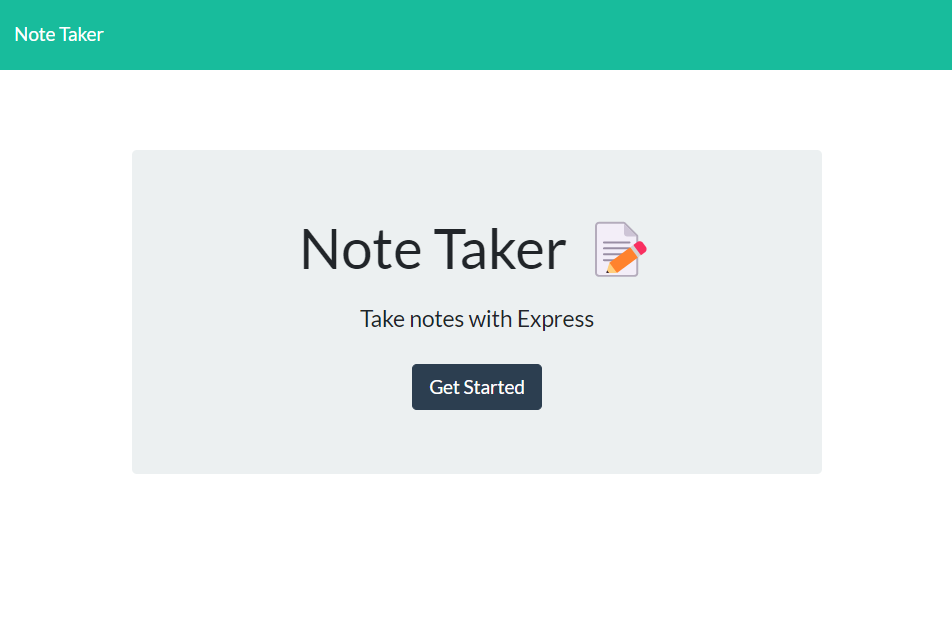
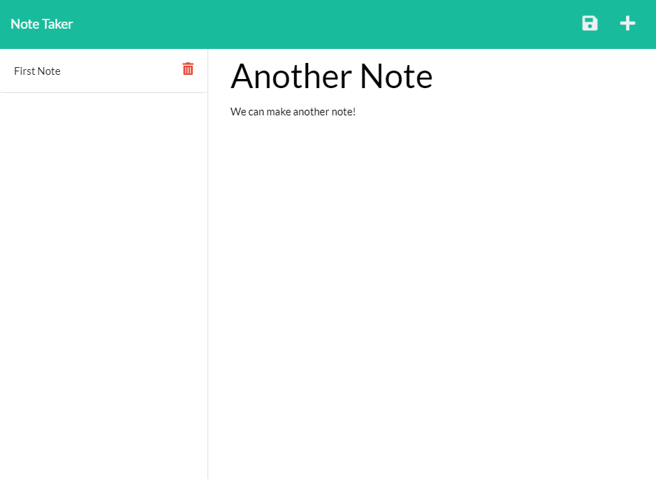

Assignment to create a webpage for taking Notes








## Deployed Application
Click [here](https://chucknotetakr.herokuapp.com/) for deployed link.

## User Story
```
AS A user, I want to be able to write and save notes.
I WANT to be able to delete notes I've written before.
SO THAT I can organize my thoughts and keep track of tasks I need to complete.
```

## Technology

1. Express.js 
2. Node.js
3. uuid

## Usage 
Type in the following commands

``` 
npm i
```

```
node.js
```

## License
MIT